<!-- SOURCE: https://allenkenoyerglass.com/classes/ -->
<!-- EXTRACTED: 2026-05-19 -->

# Stained Glass Classes & Workshops | Allen Kenoyer Glass

## Classes

ALL CLASSES MUST BE SCHEDULED/CHANGED IN PERSON OR ON THE PHONE DURING STORE HOURS.

Prices are subject to change without notice.

##### STAINED GLASS CLASSES

### Beginning Copper Foil – Beginner Class

**5 Weeks – $150 + kit + glass  
**

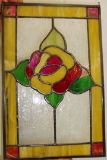

You will learn about the tools of the trade, such as the glass cutter, pliers and running pliers. As in any craft, knowing what tools to purchase and how to use them properly is essential. The class will cover the theory of “Why Glass Breaks?” holding the cutter, scoring the glass, breaking using pliers, breaking using running pliers, using a straight edge, cutting inside curves, outside curves, and ovals. You will go away with confidence. This class is for beginners as well as for those who need to enhance their cutting skills. The class focuses on the copper foil method of stained glass construction. During the class, students will complete the starter project using glass they select. You will complete a small stained glass window (approx. 9“ X 14”). Several different patterns are available for you to choose from at the first class.

Must purchase a tool kit (class, kit & glass comes to about $350).  
Grinders and other specialty equipment provided for use in class.

**Limit 7 Students**

**Session Choices:**  
_6/23/26 – 7/21/26 | Tuesdays | 6:00pm – 8:30pm | **sold out  
**8/15/26 -9/19/26| Saturdays |10:00am – 12:30pm (no class 9/5)  
9/22/26 – 10/20/26 | Tuesdays | 6:00pm – 8:30pm  
_

_Call or come into the shop to register. Send Questions to: [classes@allenkenoyerglass.com](mailto:classes@allenkenoyerglass.com)_

### Beginning Lead – Intermediate

**4 Weeks – $100 + kit + glass  
**

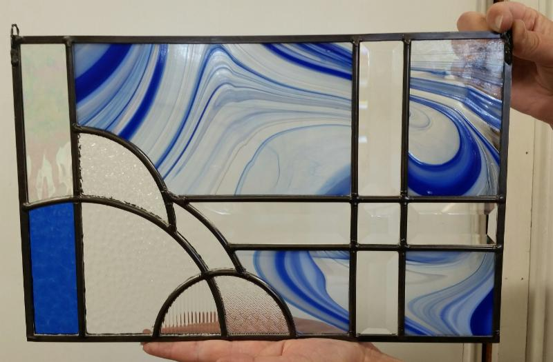

There is more to stained glass than copper foil. Learn the basics of working with lead came. Learn what tools to use, layout, studio setup, safety information, came selection, lead soldering techniques, cementing and much more. This technique works well when doing larger panels or entry door panels. You will go away with confidence. Are you interested in building larger or more geometric designs? Then this is for you. We focus on the lead came method of stained glass construction. Students will complete a leaded glass panel (approx. 9” X 14”).

Must purchase a tool kit (upgrade kit & glass) and cut and grind your glass prior to the first class.  Bring all your cut & ground glass, safety glasses, and cutting tools to the first class.

**Limit 5 Students**  
**Prerequisite: Beginning Copper Foil  
Bring to First class: Prepared glass, paper towels, cutting tools.  
**

**Session Choices:  
**7/11/26 – 8/1/26| Saturdays |10:00am – 12:30pm

_Send Questions to: [classes@allenkenoyerglass.com](mailto:classes@allenkenoyerglass.com)_

### Cutting Class

**By Private Lesson $35 call to schedule**

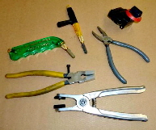

Whether you are new to glass, or an old hand and want to improve your skills. This class will teach you how to cut glass. Especially good for fusing & mosaic students who want to enhance their glass experience. We will demonstrate of all the latest tools for cutting glass.

**By Appointment**

_Email questions to: classes@allenkenoyerglass.com_

### 3D Hummingbird Class – Intermediate Class

**1 SESSION $45 + supplies**

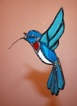

If you have been in the shop lately you may have seen this little guy. A colorful 3 dimensional hummingbird without using the lead bodies our other 3D class uses.

You Must pre-cut and foil your glass.

**Prerequisite: Beginning Copper foil profency  
Bring to class: Prepared glass, iron & soldering supplies, pins, white board, paper towels, chemicals, wedgies.  
**

_**Session Choices:**  
_

_8/12/26 | Tuesday | 6:00pm – 8:30pm_

_Email questions to:_ [classes@allenkenoyerglass.com](mailto:classes@allenkenoyerglass.com)

### 3-D Beveled Star

**$35 Tuition +  supplies**

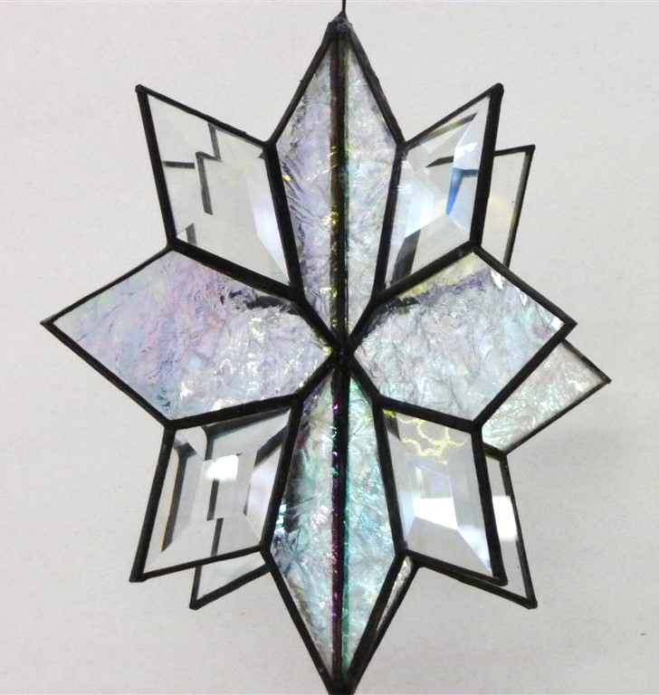

This beautiful 3 dimension Star can be made in clear or colors.  Make a new family heirloom.  Definitely a stunning piece.

**Prerequisite: Beginning Foil Class or equivalent  
Bring to class: Prepared glass, iron & soldering supplies, pins, white board, paper towels, chemicals, wedgies.**  
**Limit 7 Students**

_**Session Choices:**_

_Send Questions to: [classes@allenkenoyerglass.com](mailto:classes@allenkenoyerglass.com)_

### 3-D Butter-Flyers

**$120 Tuition +  $10 kit + supplies**

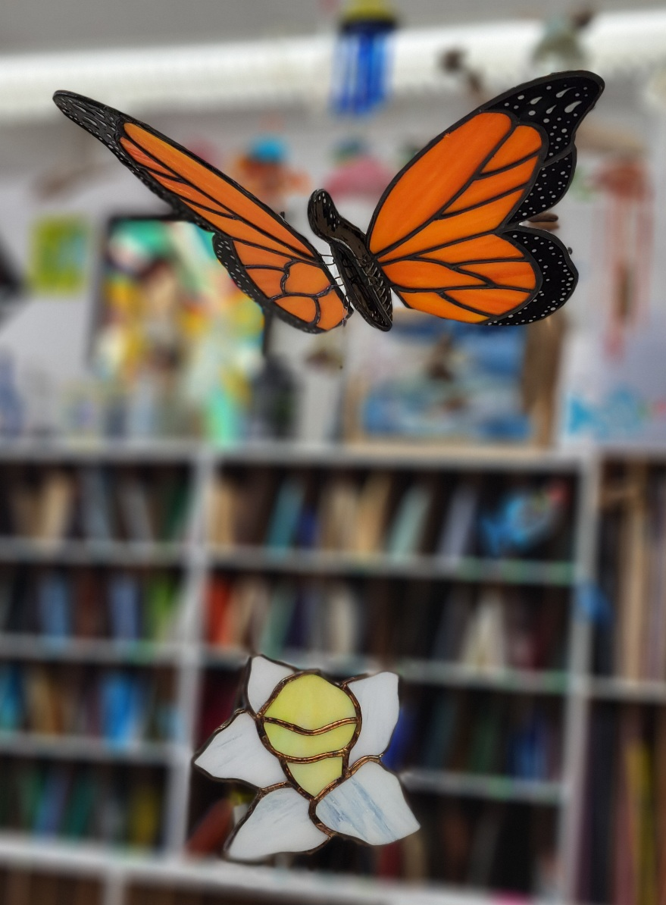

We are excited to offer this new class. Learn all the tips and techniques to make a beautiful 3D Flying Butterfly. These gorgeous winged flyers are perfect for dressing up your patio or yard, but look great inside as well. (Due to time constraints, the other patterns seen in the shop are not going to be offered for this new class, but will be available to class graduates for purchase.)

This is a 2 Session class and there is pre-work required. Must cut, grind & foil prior to first class. Pattern & supply list available upon payment of tuition.

No cancellations/refunds for this class so be sure to check your calendars before signing up

Prerequisite: Competency in the Copper foil technique

**Bring to class: Prepared glass, iron & soldering supplies, pins, white board, paper towels, chemicals.**  
**Limit 7 Students**

_**Session Choices:**_

9/19/26-9/26/26| Saturdays |1:30pm – 4:30pm

_Send Questions to: [classes@allenkenoyerglass.com](mailto:classes@allenkenoyerglass.com)_

### Creative Abstracts – 2 weeks – Intermediate Class

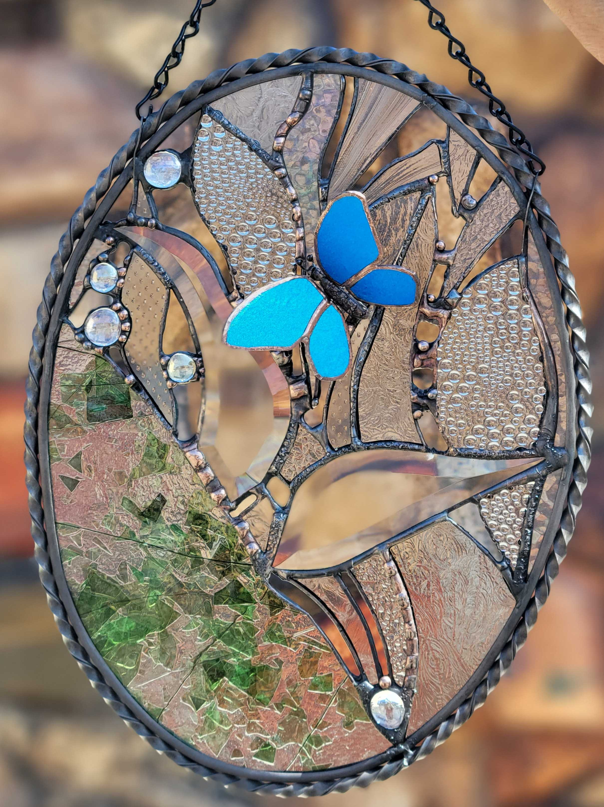
**2 Sessions  
$50 + materials**

Bring in your scrap glass, jewels, and oddities that can withstand foiling & soldering. We will teach you how to turn them into works of art using negative space & more.  Surround them in beautiful bevels or create a Yard Art Piece.

You will create a masterpiece! You need to bring in all your foiling and soldering supplies including your soldering iron (or you can rent one of ours).

**Prerequisite: Beginning Copper foil or equivalent knowledge.  Decorative Soldering a plus, but not required.  
Bring to class: Focal,  iron & soldering supplies, pins, layout blocks,  white board, paper towels, chemicals.  
****Limit 7 Students**

_**Session Choices:**_

_Send Questions to: [classes@allenkenoyerglass.com](mailto:classes@allenkenoyerglass.com)_

### Box Class – Intermediate

**3 Weeks  
$85 + supplies**

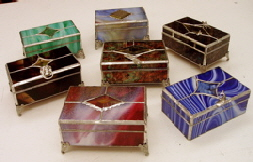

Learn the secrets of a well made stained glass box. You’ll learn to make a box with a simple hinge. You’ll be amazed at the beautiful boxes you can make with glass. This is a fast paced class, so students must be confident in their skills.

**Prerequisite: Beginning Foil Class  
Bring to First class: Copper Foil supply kit, white board, paper towels.  
**

**Session Choices:**

Send Questions to_: [classes@allenkenoyerglass.com](mailto:classes@allenkenoyerglass.com)_

### Decorative Soldering Techniques – Intermediate Class

**1 session $35 + $25 Kit**

**Prerequisite: Prior Allen Kenoyer Foil class or teacher approval.**

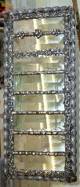 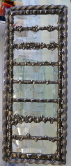

If you are comfortable with your soldering skills and want to take it to the next level, then this class is for you. Learn to create different looks on your projects with decorative solder. Discover the different types of solder and what they can add to your project. Bring your Full copper foil kit including white board, pins, soldering iron, solder, flux, flux brush, cleaner, polish, & polishing cloth that you normally use. If you don’t have your own iron you can rent one of ours for $8.  If you don’t bring your chemicals there is a $5 fee.

Kit Fee includes: Glass, lead, foil & use of 3 different patinas.

**Limit 7 Students  
Bring to class: iron & soldering supplies, white board, paper towels.  
**

**Session Choices:  
**

6/20/26 | Saturday | 1:30pm – 4:00pm – **sold out  
**8/25/26 | Tuesday | 6:00pm – 8:30pm

_Email questions to_:[classes@allenkenoyerglass.com](mailto:classes@allenkenoyerglass.com)

### Encased in Glass – Butterflies

**1 session $55 + $10 Kit**

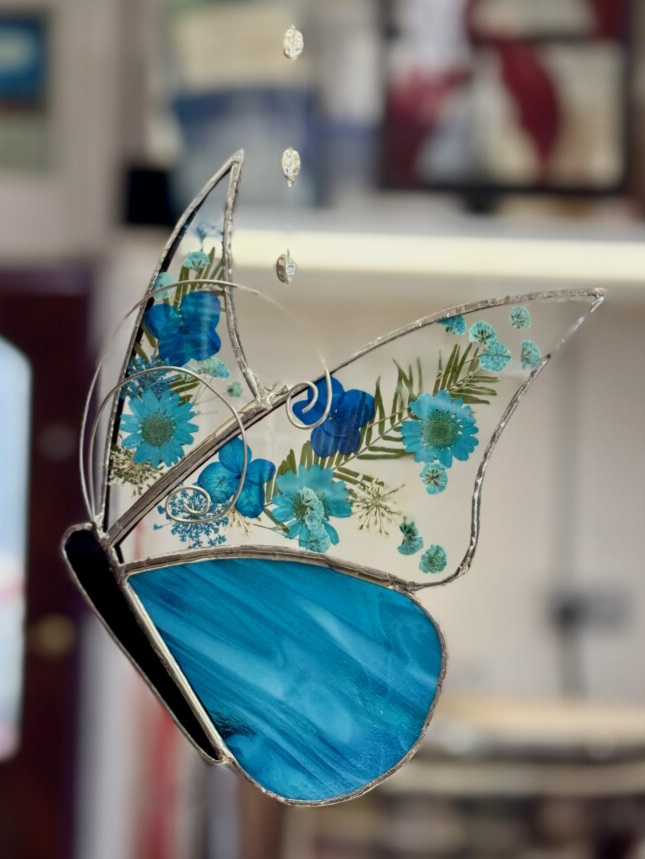

After MANY requests we are offering a class to encase things in glass. This class is a variation of our encasing memories class, but does not include frame design. Learn the tips and tricks to sandwich items in glass and create a whole new dimension to your work. Learn to encase dried flowers or other items in glass and see how it really takes the project to another level! 

This is a 1 Session extended class and there is pre-work required. Must cut, grind & foil prior to first class. Pattern & supply list available upon payment of tuition.

Student is responsible for getting items to encase, flower, photo, etc.

Prerequisite: Competency in the Copper foil technique

**Limit 7 Students  
Bring to class: Prepared glass, dried flowers, iron & soldering supplies, white board, paper towels, chemicals.**

_**Session Choices:**_

05/30/26 | Saturday | 1:30pm – 5:00pm | 2 spots left

_Send Questions to: [classes@allenkenoyerglass.com](mailto:classes@allenkenoyerglass.com)_

### Flat Panel Lamp – Intermediate

**4 Weeks – $120 + glass & supplies**

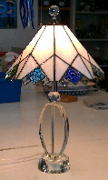

Wanting to go a little further and start to work in 3 dimensions. This is a great course for people who have done a beginner course or wanting to do their first lamp. Learn the basics of making panel lamps as patterns for this lamp course.  This is a fast moving class with LOTS of homework.

_**You must register, choose your pattern, & order any special base glass 2 weeks prior to class.**_

**Prerequisite: Competency with Beginning Copper foil or equivalent knowledge  
Bring to First class: Copper Foil class kit including cutting tools.**  
**Class size is limited to 4 students.**

Session Choices:

_Email questions to:_[classes@allenkenoyerglass.com](mailto:classes@allenkenoyerglass.com)

### Holiday Votive Holder – Intermediate Class

### $35 tuition + $15 supply fee

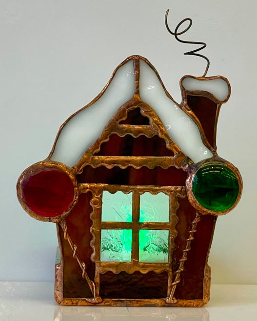

Choose from several holiday themed  votive candle holders.  Haunted House, Gingerbread house (pictured) , Cupcake, Seashell, Holiday Tree.  Pattern & pre-work instructions provided upon registration.

_**Limit 7 Students – PREWORK REQUIRED  
**_

_**Prerequisite: Beginning Foil Class**_

**Bring to class: Prepared glass, iron & soldering supplies, pins, white board, paper towels, chemicals, wedgies.**

_**Session Choices:**  
_

_Call or come into the shop to register._

_Email questions to: [classes@allenkenoyerglass.com](mailto:classes@allenkenoyerglass.com)_

### Mystical Orbs – 2 weeks – Intermediate Class

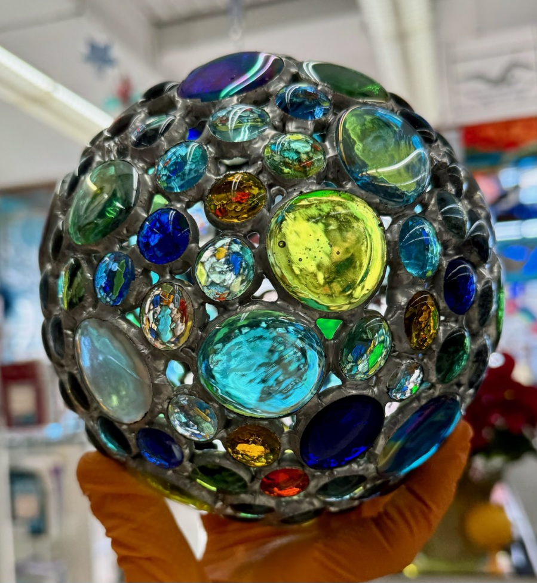 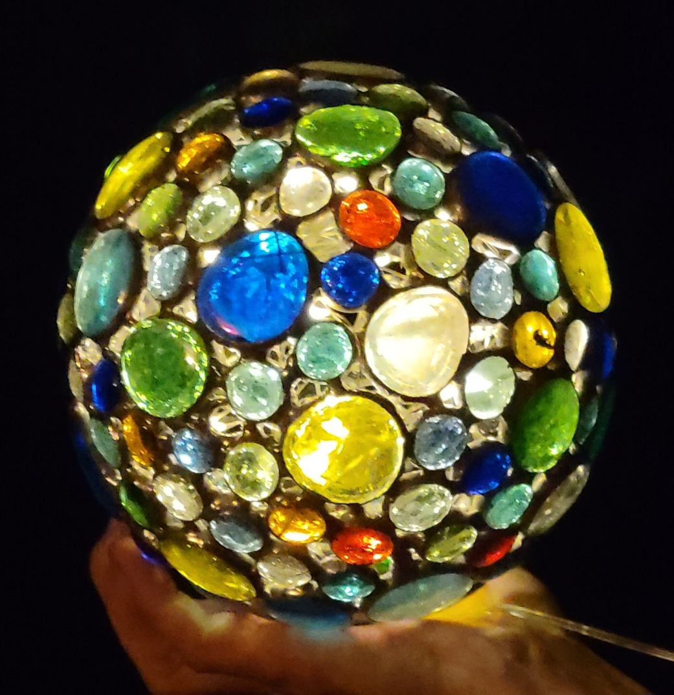
**2 Sessions  
$100 + kit + materials**

**Copper foil proficiency required**

The extra time in between classes is needed to prep for the second class. LOTS of homework is required so be prepared. Kit will include 8″ Foam Ball, Solar Fairy Light kit, and some wire – price for kit coming.

Students must bring all stained glass supplies including: Glass cutter, running pliers, !/4″ Black Back foil, Solder, flux, Soldering Iron (or rent ours), soldering board, pins, etc. Basically your beginner kit it you took the class from us.

**Prerequisite: Beginning Copper foil or equivalent knowledge.  Decorative Soldering a plus, but not required.  
****Bring to class:  Prepared glass globs,  copper foil supplies, iron & soldering supplies, white board, paper towels, chemicals.**  
**Limit 7 Students  – NO MAKEUP CLASSES**

**\*\*\*PRE-WORK REQUIRED\*\*\* Pickup instructions when you sign up. Must come to class with your supplies & prep work done.**

_**Session Choices:**_

_Send Questions to: [classes@allenkenoyerglass.com](mailto:classes@allenkenoyerglass.com)_

### Shadow Art – Intermediate – 3 wks

**2 session – $75 + glass & supplies.**

All NEW class. Create a masterpiece using decorative soldering techniques on glass billets.

Using the depth of this type of glass create an amazing 2 sided 3-d effect.

Class fee includes: tuition only Students are responsible for their supplies. Glass Billets MUST be ordered at least 3 weeks in advance and cost approx  55 – 75 each.

**Limit 5 Students**  
**Prerequisite: Basic Soldering (Beg Foil Class or Private Lesson), Decorative soldering helpful, but not required  
Bring to class: All copper foil supplies, iron & soldering supplies, white board, paper towels, chemicals.  
**

_**Session Choices:  
**_9/1/26 – 9/15/26 | Tuesdays | 6:00pm – 8:30pm

_Send Questions to: [classes@allenkenoyerglass.com](mailto:classes@allenkenoyerglass.com)_

**\*\*\*This is a NON-TRANSFERABLE, NON-REFUNDABLE CLASS – no exceptions!\*\*\***

### SpiderWebs – Intermediate Foil – $35 tuition + $10 supply fee

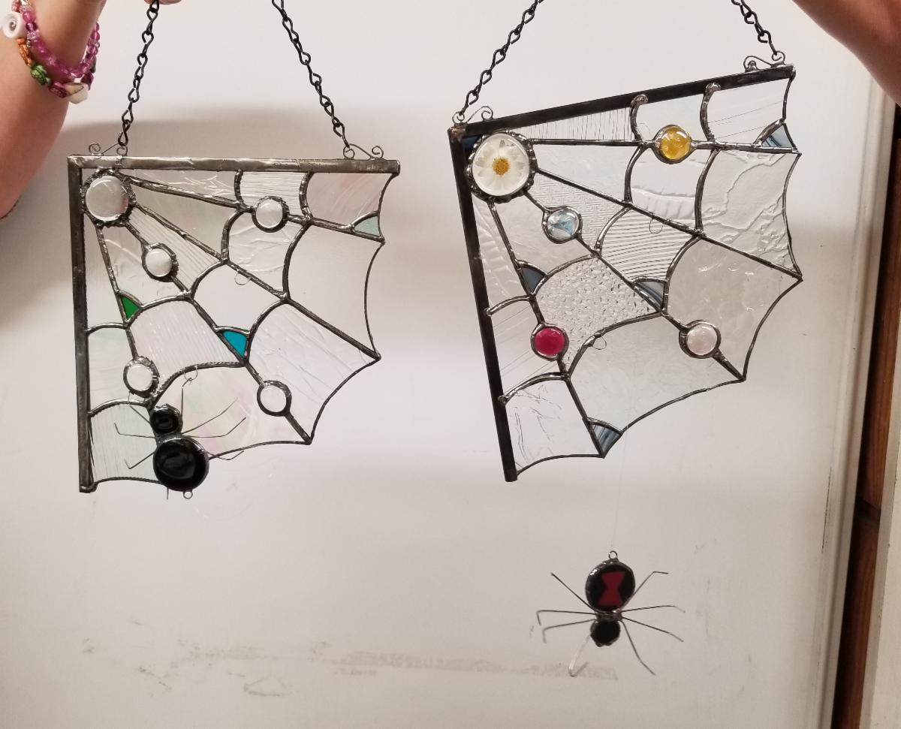

Just in time for Halloween! Make this fun spiderweb using scrap clear glass & globs.

**\*\*\*PRE-WORK REQUIRED\*\*\*** Pickup pattern when you sign up. Must come to class with your glass cut, ground & foiled.

Prerequisite: Beginning Copper Foil proficiency

**Limit 7 Students  
Bring to class: Prepared glass, iron & soldering supplies, white board, paper towels, chemicals.  
**

_**Session Choices:**_

_Email questions to: [classes@allenkenoyerglass.com](mailto:classes@allenkenoyerglass.com)_

### Sunflower Yard Art – Intermediate/Advanced Foil

**$75 class fee + $55 kit fee + materials**

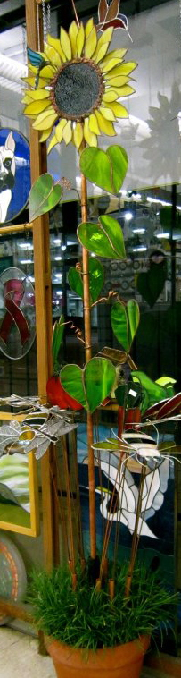

Just imagine a full size sunflower (over 6 feet tall) on a copper pole. You need to come in and pick up your supply list and instruction sheet. Then show up with all your pre-tinned pieces and all your soldering supplies including your soldering iron (or you can use one of ours). Pick up class info when registering.

**Class limited to 6 students so register quickly.**  
**Prerequisite: Beginning Foil Class or Equivalent Experience.  
Bring to class: Prepared glass, iron & soldering supplies, white board, paper towels, chemicals.  
**

**Session Choices:**Send Questions to[:](mailto:classes@allenkenoyerglass.com)[classes@allenkenoyerglass.com](mailto:classes@allenkenoyerglass.com)

### Treasures In Stained Glass “Encasing Memories” Frames – Intermediate

**2wks $65 + Supplies**

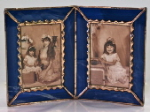 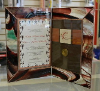

Do you have something of great value to you…photos, postcards, special letters, or cards? Learn how to encase them in beautiful stained glass so that you can display them and pass them on for generations to come!

**Prerequisite: Competency in Copper Foil Class  
Bring to class: Item to encase, copper foil kit, iron & soldering supplies, white board, paper towels, chemicals.  
**

_Email questions to: [classes@allenkenoyerglass.com](mailto:classes@allenkenoyerglass.com)_

### Wind Spinners – Intermediate

**4 Hours**  
**$45 + materials**

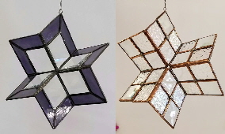

New class at the shop. Make these stunning outdoor wind spinners using your favorite glass and add in some light catching bevels.

Project based from the book 40 Great Stained Glass Projects by Michael Johnston

**Prerequisite: Competency in Copper Foil.  
Bring to class: Prepared glass, iron & soldering supplies, pins, white board, paper towels, chemicals.**  
**Limit 7 Students**

_**Session Choices:  
**_7/18/26 | Saturday | 1:30-4:30pm

_Call or come into the shop to register.  
__Email questions to_:[classes@allenkenoyerglass.com](mailto:classes@allenkenoyerglass.com)

##### MOSAIC CLASSES

### Mosaic Madness – Glass on Glass – Beginner Class

**2 Sessions $55 + supplies**

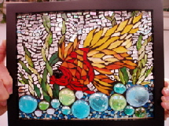

Learn how to do glass on glass mosaics. Have fun learning the techniques for direct mosaics using scrap glass, glass nuggets, glass tiles, glue, and grout. Scrap glass is included, all other items are student provided if wanted.

Students must bring an 8×10 picture frame NOT a document frame.   Bring your safety glasses if you have them.  All tools are available for purchase at a discount in class.  Ask what to bring if you already own some tools.  Bring a box and some baggies for your cut pieces.

**No prerequisite.  You will not finish in class.  
Bring to class:  Box for glass, 8×10 picture frame, baggies, paper towels, safety glasses.  
**If you already own mosaic nippers please bring them – they will be available for purchase**Limit 7 Students**  

**Session  
**

4/29/26 | Wednesday| 6:00pm – 8:30pm | **Sold Out**  
5/09/26 | Saturday | 1:30pm – 4:00pm | **Sold Out**

_Send Questions to__: [classes@allenkenoyerglass.com](mailto:classes@allenkenoyerglass.com)_

**Grouting Session choices below  
Let us know when you are ready to grout and we will put one on the schedule!  
**

_Send Questions to: classes@allenkenoyerglass.com_

### Mosaic Glass On Wood – Beginner Class

**2 Sessions $55 + supplies**

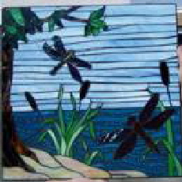

Learn to make a beautiful 16″ Square mosaic table or wall hanging for your home in this class even if you have never done mosaics before!

Scrap glass is included. Supplies will be available for purchase during class. $9 for a 16” plywood or bring your own.

**No Prerequisite – You will not finish in class.  
**Glass cutting a plus, not required**  
Bring to class:  Box for glass, baggies, paper towels, safety glasses.  
**If you already own mosaic nippers please bring them – they will be available for purchase  
**Limit 7 Students**

**Grouting Session choices below**

**Session Choices:**

_Email questions to : [classes@allenkenoyerglass.com](mailto:classes@allenkenoyerglass.com)_

### \*\*\*Grouting Session\*\*\*

**Price included in previous mosaic class – you MUST SIGN UP 1 week prior**

This is the grouting session for all of you who need to complete your mosaic madness or mosaic table top project. Wear clothes to get messy in. Bring thick dish-washing gloves, q-tips, wood stylus, and roll of paper towels.

Let us know when you are ready and we will schedule a class.

Don’t want to grout at home? Bring your next project to grout at our shop for only $15

**Prerequisite: First session of mosaic madness or mosaic table top  
Bring to class:  Dishwashing gloves (not nitrile), papertowels, your project dried at least 3 days.  Clothes to get dirty in.**

**Session Choices**

4/4/26 | Saturday | 1:30pm – 4:00pm  
6/6/26 | Saturday | 1:30pm – 4:00pm

Call or come in to sign up  
_Send Questions to: [classes@allenkenoyerglass.com](mailto:classes@allenkenoyerglass.com)_

##### FUSED GLASS CLASSES

First Friday Fusing Nights

**$25 Tuition + glass**

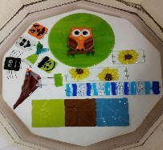

For all those fusers out there and those interested in giving fusing a try.  
This is not a class, it is an “Open Idea” night where you create your own thing.  New students will be guided.

**Limit 7 Students at at time.** $25 holds your spot!

**Upcoming Dates**

_No FFFF in April 2026  
5/1/26 | 3-5:30  
5/1/26 | 6-8:30|**sold out**  
6/5/26 | 3-5:30  
6/5/26 | 6-8:30  
_

Includes 1 firing with 6×6 kiln space. Additional space and glass extra.

Come in during the class time to make your project and it will be fired and ready the next week for pickup.

**No Experience required – glass cutting a plus!  
Bring to class: Safety Glasses and mosaic nippers if you own them or borrow ours.**  
Call or come into the shop to register. Send Questions to: [classes@allenkenoyerglass.com](mailto:classes@allenkenoyerglass.com)

Make it a date night or girls night out!

### **Dot Art – Beginning**

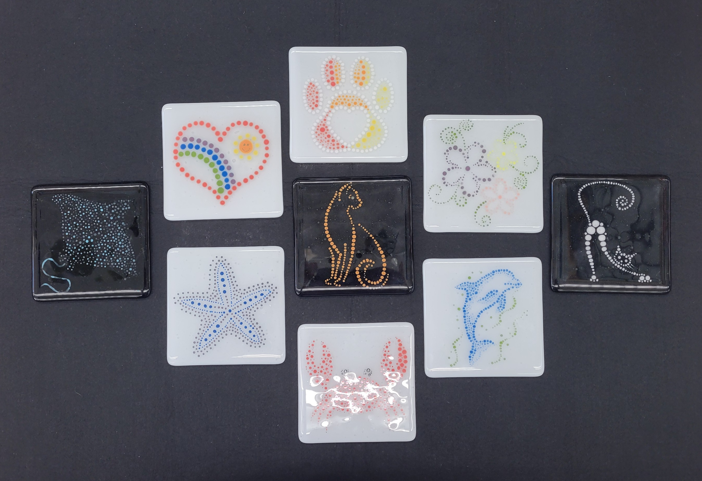
**$50 + $15 kit fee**

This is a great fun class that introduces **Colors For Earth** enamel paints.  Using dotting tools you will learn basic pontillism and make two 4″ tiles using our paint kits.  These tiles will be fired onto black or white bases.  For anadditional charge they can be slumped into sushi dishes.  If time allows you can make additional ones for $15 each.  Everything is done in 96 COE glass for this class.

**No experience required.   
Bring to class:  If you want some small simple designs**  
**Limit 8 Students**

**Session:  
**_4/21/26 | Tuesday | 6:00 – 8:30pm_

_Call or come into the shop to register. Send Questions to: [classes@allenkenoyerglass.com](mailto:classes@allenkenoyerglass.com)_

### **Dot Art 2 – Intermediate**

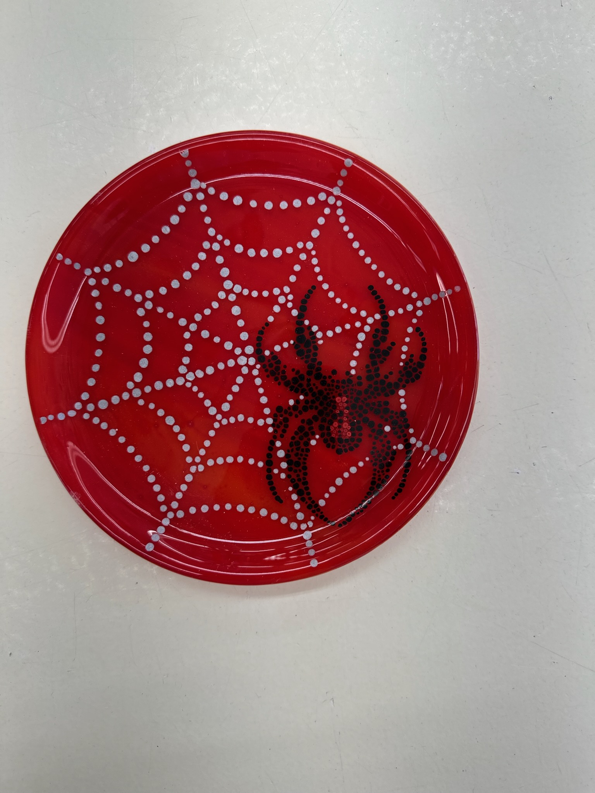

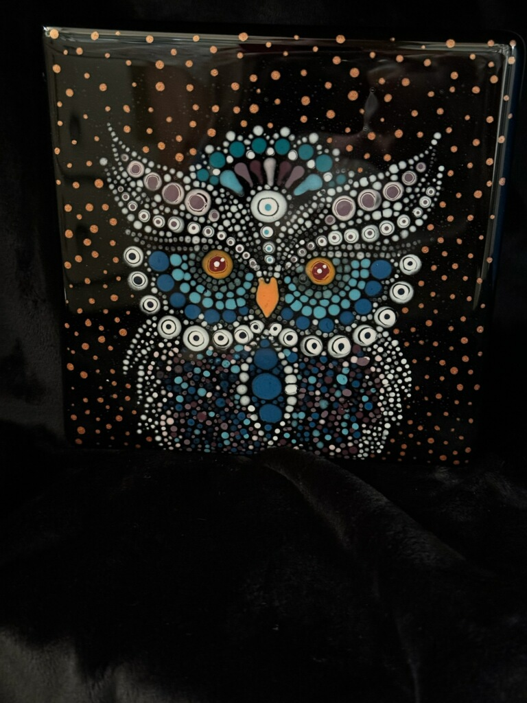

This class builds on the Dot Art class using **Colors For Earth** enamel paints.  Using dotting tools continue your experimentation in potillism making larger  
pieces on glass of your choice.   Includes 1 firing for up to 8″ x  8″ piece.

**Dot Art class required.**   
**Limit 8 Students**

**Session:  
**

_Call or come into the shop to register. Send Questions to: [classes@allenkenoyerglass.com](mailto:classes@allenkenoyerglass.com)_

### **Fused Hearts – Beginning**

**$65**

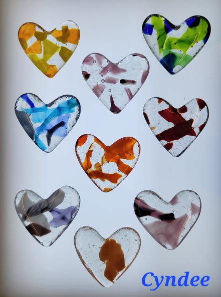

In this fun class you will use lots of scrap glass to create  12 unique casted glass hearts.  Great for a girls night or date night too.

**No experience required.   
Bring to Class: Mosaic Nippers if you have them, safety glasses**  
**Limit 8 Students**

**Session:  
**

_Call or come into the shop to register. Send Questions to: [classes@allenkenoyerglass.com](mailto:classes@allenkenoyerglass.com)_

### Coral Sea Bowl Mini- Beginning

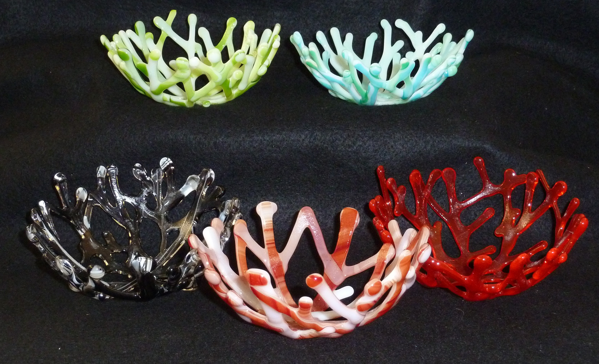
**$55  
**

Have fun making a a coral sea bowl.  Fee includes class, 2 firings, & $10 glass credit (should cover expenses for most glass colors – hot colors may be more)

**No experience required.   
Bring to class: Safety Glasses, Paper towels & Mosaic Nippers if you have them**  
**Limit 7 Students**

**Session:  
**

4/18/26 | Saturday | 1:30-4:00pm |**Sold Out**

_Send Questions to:_  _[classes@allenkenoyerglass.com](mailto:classes@allenkenoyerglass.com)_

### Doodle Plates/Frit Painting – Beginning

**$40 + $15 Kit**

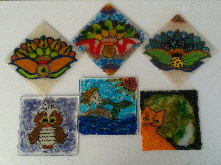

Ever wonder how to use glass frit and paint? This is the class for you! Students will make a 6” x 6” plate using frits and glass paints. All items are included and one firing.

**No experience required.**  
**Limit 7 Students**

_**Session:  
**Email questions to: [classes@allenkenoyerglass.com](mailto:classes@allenkenoyerglass.com)_

### Easter Eggs/Relief Fusing – Beginning

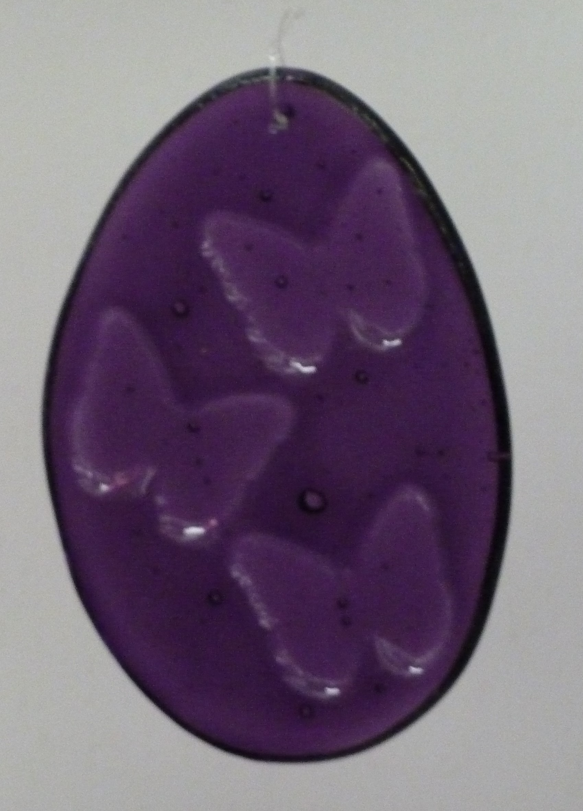
**$35 + glass**

In this fusing class we use thin fiber paper, punches, scissors, etc to get a relief effect in the fused glass. You don’t have to make Easter Eggs, but they are a lot of fun.  Fee includes firing for up to 6×6 panel, thin fiber paper, and use of our punches.

**No experience required.  Cutting helpful**  
**Limit 7 Students**

_**Session:**_  
_Email questions to: [classes@allenkenoyerglass.com](mailto:classes@allenkenoyerglass.com)_

### Fused Fish Frenzy – 2 weeks- Beginner

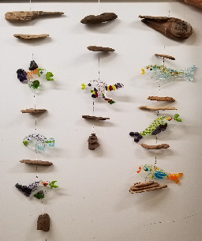
**2 Weeks $55 Tuition + $20 Kit**  
**firing & wiring included. Driftwood not included. Kit covers all you need for 3 Fish. Dichro Extra**

Have some fun with these crazy flying fish. Welcome addition to any ocean lover.

**Prerequisite: NONE  
Bring to class: Safety Glasses and mosaic nippers if you own them or borrow ours.**  
**Limit 7 Students**

**Session Choices:**

05/27/26 – 06/03/26 | Wednesdays | 6:00-8:30pm

_Send Questions to:_ [classes@allenkenoyerglass.com](mailto:classes@allenkenoyerglass.com)

### Fused Jellyfish – Beginner Class

**2 Sessions  
$65 + materials**

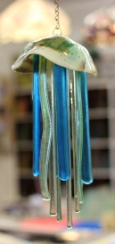

You’ve seen them hanging in the store, now one can hang in your home. OR what an amazing gift this would be! Classes are sell out as fast, so sign up quickly.

Cost is includes all firings, stringing wire, crimping beads, and disk.  Glass not included – Tuition must be prepaid to hold your spot.

**Limit 7 Students.  
Bring to class: Safety Glasses and mosaic nippers if you own them or borrow ours.  
**

**Session  
**05/13/26 – 05/20/26 | Tuesdays | 6:00-8:30pm | **1 spot left**  
8/1/26 – 8/8/26 | Saturdays | 1:30pm – 4:00pm | **1 spot left**

_Send Questions to: [classes@allenkenoyerglass.com](mailto:classes@allenkenoyerglass.com)_

### Fused Mushrooms – Beginner Class

**$55 + Glass**

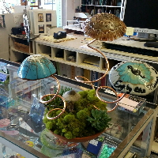

Learn how to make 2 different styles of fused mushrooms. One uses the slurry technique and the other is the “hammertime”. Class includes everything for the slurry mushroom, and all the frit and firings. For the “hammer” technique students will purchase the glass. Firings included.

**Bring to class: Safety Glasses if you own them or borrow ours.**

**No prerequisite.**  
**Limit 5 Students**

**Session  
**_Email questions to: [classes@allenkenoyerglass.com](mailto:classes@allenkenoyerglass.com)_

### Texture Molds – Beginner

**1 Week $55.00 + Glass**

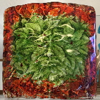 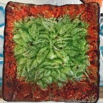

We have a variety of texture molds from Peacocks to Holidays and more! First come first choice on molds. Learn how to apply frit and make amazing pieces. Stop by the store for more information and to see our selection.

**Price includes tuition, 1 firings & Frit. Glass Fee for Base Glass depends on Mold Size**

**Second firing $10**

**Prerequisite: None!**

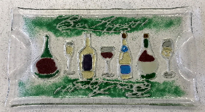**Limit 7 Students**

_Email questions to: [classes@allenkenoyerglass.com](mailto:classes@allenkenoyerglass.com)_

### Fused Glass Wave – Beginner

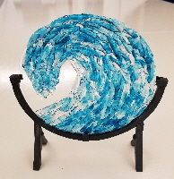

**1 Week $40 Tuition + Glass fee****firing included. Glass extra, Stands available for purchase.**

Catch a wave this spring with our new WAVE Class. Approx 8”

**Prerequisite: NONE  
Bring to class: Safety Glasses and mosaic nippers if you own them or borrow ours.  
Beginner: Limit 7 Students**

_**Session**_

04/25/26 | Saturday | 1:30pm – 4:00pm **| Sold out**

_Send Questions to: [classes@allenkenoyerglass.com](mailto:classes@allenkenoyerglass.com)_

#### Fused Wind Chimes – Intermediate Class  
3 Weeks – $85 + glass

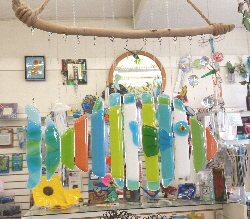

Choose from several different designs.

Price includes tuition, high Temp wire, beading wire & crimps, and one firing. Student must bring hanging support (driftwood, corbel, decorative beads, etc).

**Prerequisite: Glass cutting Skills required.**   
**Bring to class: Safety Glasses, paper towels, cutting tools**

**Limit 7 Students**  

**Session**

3/14/26 – 3/28/26 | Saturdays | 1:30pm – 4:00pm |**Sold Out**

_Send Questions to: [classes@allenkenoyerglass.com](mailto:classes@allenkenoyerglass.com)_

### Crystal Christmas Trees – Beginner

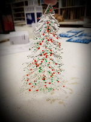

**$35**
Come make a stunning Holiday Light catcher using scrap glass & frit.  This delicate piece is sure to enchant and delight during the holidays and beyond.  Cost includes tuition and supplies.  Dichroic glass extra.

**Limit 7 Students per session  
Bring to class: Safety Glasses and mosaic nippers if you own them or borrow ours.  
**

_**Session  
**_

_Email questions to: [classes@allenkenoyerglass.com](mailto:classes@allenkenoyerglass.com)_

### Fairy Forest – Beginner

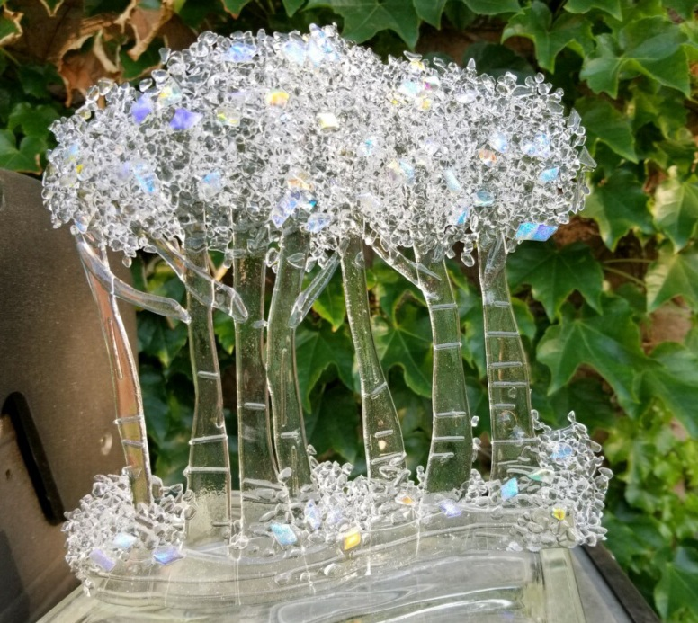

**$35 + $50 kit**
Make a whimsical art piece in fused glass. This brand new class you can choose from 2 different sizes.

**Bring to class: Safety Glasses and mosaic nippers if you own them or borrow ours.**

Prerequisite: None

Limit 7 Students

Session Choices:

_Email questions to: [classes@allenkenoyerglass.com](mailto:classes@allenkenoyerglass.com)_

### Yard Stake – Beginner

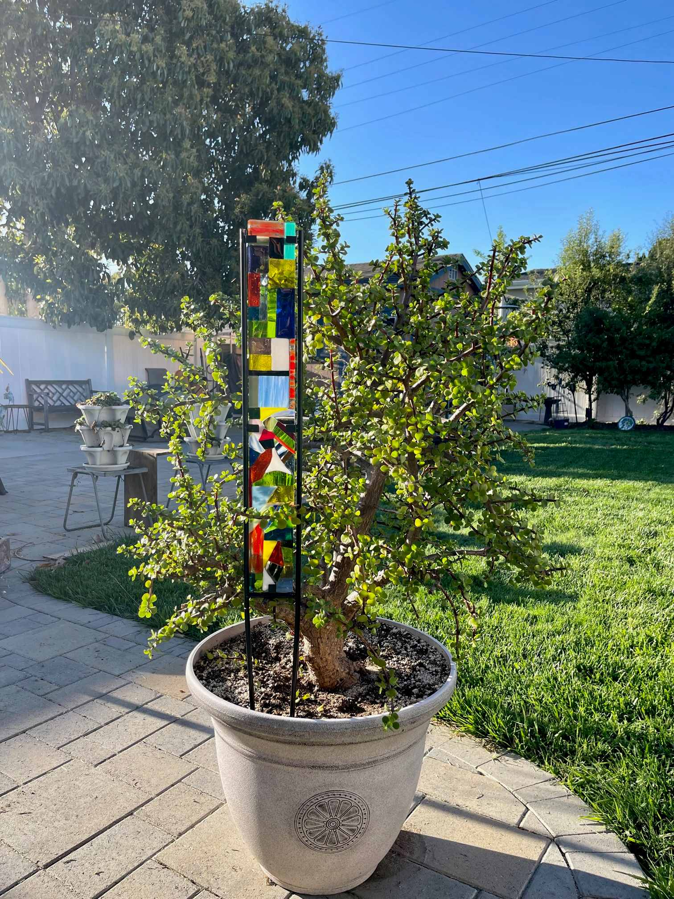
**$45 + $55 kit + specialty glass**

These Fun garden stakes are about 3″ x 24″ and hold a fused piece of glass.  Have fun creating a patchwork of glass color for your yard, or make a name panel.  You are only limited by your imagination.

Kit includes stand and $15 in glass credit.  Don’t want to work on a clear background?  Use your glass credit towards other glass choices.    Dichroic Glass extra.

**Bring to class: Safety Glasses and mosaic nippers if you own them or borrow ours.**

Prerequisite: None.  Glass Cutting Helpful, but not required  

Limit 7 Students

Session Choices:

4/11/26 | Saturday | 10:00am – 12:30pm|**1 spot left**

_Email questions to: [classes@allenkenoyerglass.com](mailto:classes@allenkenoyerglass.com)_

### Fused Sand Art – Beginner

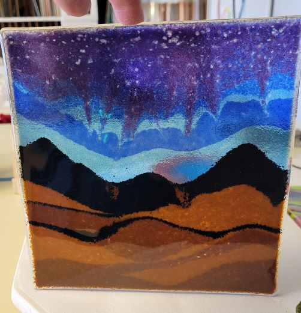
**$30 + $25 kit fee  
**

Remember the sand art you used to do as a kid?  Here’s your chance to make an interesting piece of your own working vertically.  Based off the technique developed by the late David Alcala.  You can make a 8″ square or 7″ Round piece that we will fuse.  Kit Price includes base glass, fine frit, and 1 firing.

**Limit 7 Students per session**

_**Session  
**__Email questions to: [classes@allenkenoyerglass.com](mailto:classes@allenkenoyerglass.com)_

### Fused Glass Menorah – Beginner

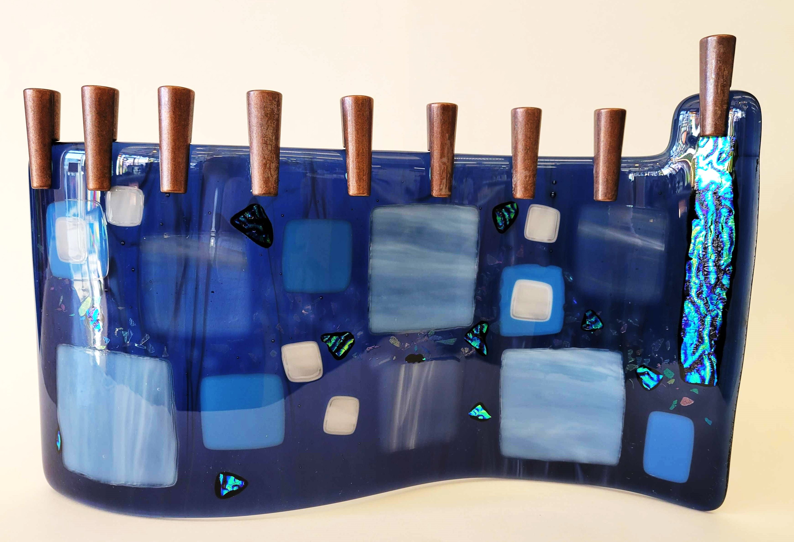
**$65 + Glass & Supplies**

Make a beautiful family heirloom to pass on for generations to come.  You will design and make this beautiful Menorah

  
**Limit 7 Students per session  
Bring to class: Safety Glasses, paper towels.  Also cutting tools and mosaic nippers if you own them or borrow ours.  
**

_**Session**_  

_Call or come into the shop to register.  
__Email questions to: [classes@allenkenoyerglass.com](mailto:classes@allenkenoyerglass.com)_

### Fused Ornaments

**$15 per Ornament/3 for $40**

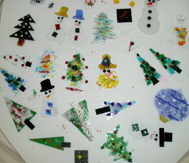

Think glass “Christmas Cookies”. We will have all the supplies out and you can drop in, decorate and leave your ornament with us to fire. This fun class will let you play to create your own ornaments. You will decorate two pre-cut ornaments and we will fire them. No experience is required so bring your friends. Kids over 8 are allowed to enroll with a parent.  All Ornaments will be done in Bullseye Glass

**Limit 8 Students per session block  
Bring to class: Safety Glasses and mosaic nippers if you own them or borrow ours.  
**

**Session choices – Start times listed:  
**

_Call or come into the shop to register.  
Email questions to: [classes@allenkenoyerglass.com](mailto:classes@allenkenoyerglass.com)_

### Introduction to Fusing Glass – $110

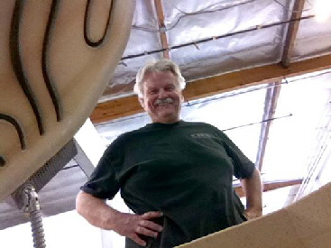

Curious about Fusing? Then this class is for you. We will introduce you to the world of fused glass, how a kiln works, and just what happens during each step of the fusing process. This will cover more of the technical side of fusing. The class is 2-1/2 hours long and all supplies are included. You will get to assemble 3 small projects that will be fired and picked up in a few days. See a whole new side of glass work. No Experience required.

**Session 1  
**

_Send Questions to: [classes@allenkenoyerglass.com](mailto:classes@allenkenoyerglass.com)_

### Lecture/Q&A on Kiln Ownership – $45

This class is great for those who own a kiln or are thinking about it. Learn all about the kilns and what ownership entails. Jim will discuss all this and more then answer all your questions & concerns.

**Session 2**  
_Send Questions to: [classes@allenkenoyerglass.com](mailto:classes@allenkenoyerglass.com)_

### Dichroic Disco – $65

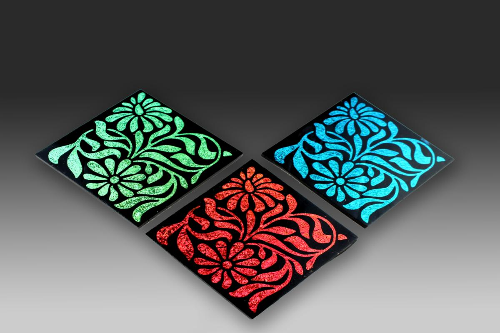

It’s all about the BLING BABY!  Learn the do’s and don’ts of working with Dichroic glass.  Make a small jewelry piece, try the acid etch process, and make Angel Tears.  Drilling holes in glass and adding bails will be demonstrated.   Price includes all supplies for the in class projects.  Additional Dichroic Glass will be available for purchase.  

**Session 3**

_  
Send Questions to: [classes@allenkenoyerglass.com](mailto:classes@allenkenoyerglass.com)_

### Glass & Gravity – $65

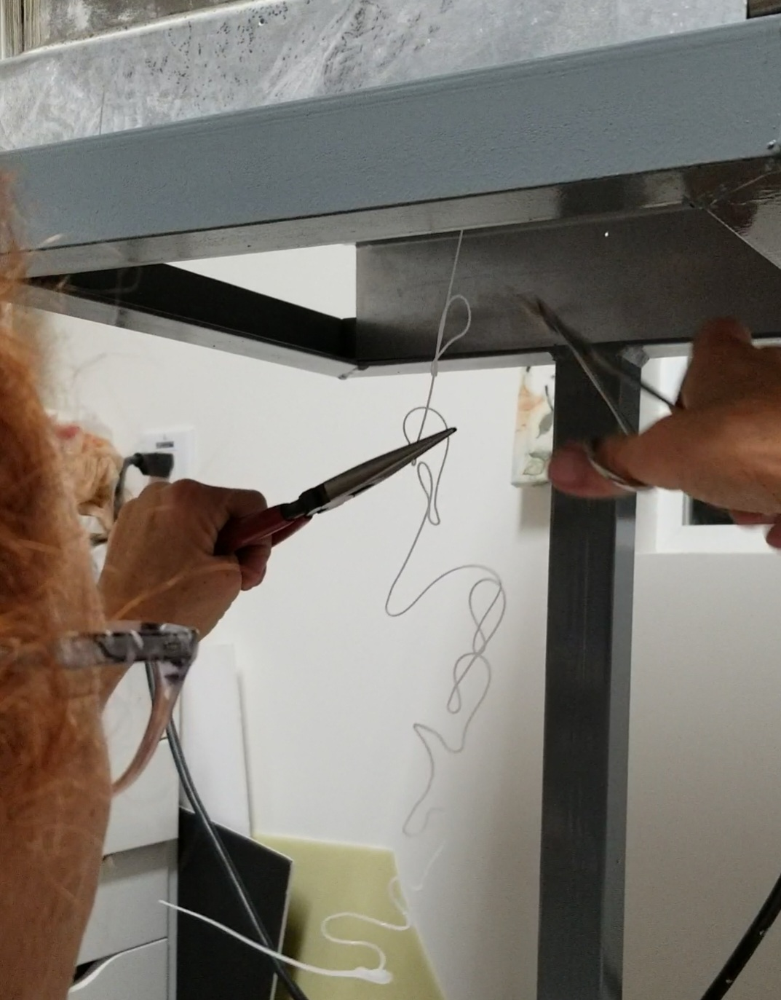

Learn about the different ways to manipulate fused glass pieces using molds and other materials. AND you will get to see how a Vitrigraph Kiln works and pull some glass. You will make a slumped item to pickup in a few days.

**Session 4**

_  
Send Questions to: [classes@allenkenoyerglass.com](mailto:classes@allenkenoyerglass.com)_

**\*\*\*Save $5 when you sign up for 2 sessions, $10 for 3 sessions & $20 for all 4 sessions\*\*\***  
**Limit 8 Students, minimum 4 students to hold the class.**

**\*\*\*These are NON-TRANSFERABLE, NON-REFUNDABLE CLASS – no exceptions!\*\*\***

##### OTHER CLASSES

### Intermediate Workshop $100/5 weeks

This is a new workshop to help those who have already taken beginning classes. This is not a class.

If you recently finished your beginning class, you’ll have a chance to work on more advanced projects and hone your skills under talented supervision. It’s also an opportunity to enjoy spending time and sharing ideas with other glassy folk.

Projects can include foil, lead, fusing, mosaic or novelty items such as boxes and lamps. Each student must have previous experience in the technique they are using from Allen Kenoyer Glass or prove competency prior to enrollment. You are required to own and use your own tools. Use of our specialty breakers and cutting grids is included. Soldering irons and shop chemicals are not included but available for an additional fee. Grinders can be reserved prior and used outside – you must purchase your own bit.

Workshop will run for five consecutive weeks. No make-up sessions are allowed. Tuition is not pro-rated for missed classes. Each participant will have approximately 8 square feet of space (4′ x 2′). If you want to work on an oversized project, you will be required to purchase extra spots – please call to review your project size. This class is limited to eight students and we expect it to fill quickly.

Come prepared: Have your project selected and all your supplies ready before workshop starts.

Limit 8 Students per session

\*\*\*If you are unable to commit to the 5 weeks and if we have space you can call to sign up each week for $25 per week\*\*\*

_**Session Choices  
**_3/25/26 – 4/22/26 | Wednesdays | 6:00pm – 8:30pm  
4/28/26 – 5/26/26 | Tuesdays | 6:00pm – 8:30pm | **SOLD OUT**  
4/30/26 – 5/28/26 | Thursdays | 2:00pm – 4:30pm  
6/24/26 – 7/22/26 | Wednesdays | 6:00pm – 8:30pm  

_Email questions to: [classes@allenkenoyerglass.com](mailto:classes@allenkenoyerglass.com)_

### Bottle Chimes – Beginner Class

**$55 +**

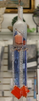 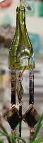

Up-cycle bottle and glass to make some amazing chimes. You bring in the bottle and we will help you cut it and create an amazing piece of art.

**No Prerequisite.** Cutting experience is helpful, but not required. Bring in 2 or more bottles – must be clean, dry and all labels removed. You will only make 1 chime during class.

_**Session Choices  
**  
_

_Email questions to: [classes@allenkenoyerglass.com](mailto:classes@allenkenoyerglass.com)_

### Wire Wrapping- Tree of Life – Beginner

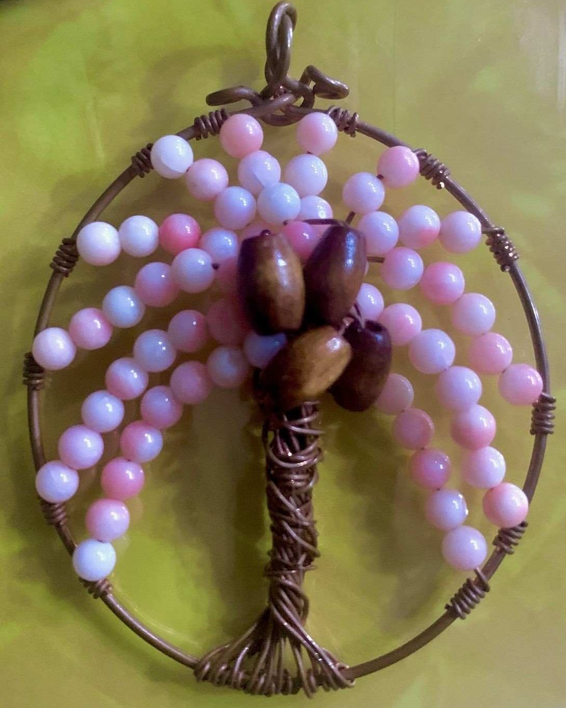
**$35 + teacher supply fee  
**

Guest teacher, Julie LaPointe, will be coming back for this highly anticipated class.  Learn how to wire weave and create a stunning pendant using Copper or Sterling Silver wire and gemstones.  Teacher will be bringing a variety of items for use/purchase.  Choose from a Tree of Life or Palm tree.

**Limit 7 Students**  
**No experience required. This is a great class for any skill level.**

**Session choices:  
**_Email questions to: [classes@allenkenoyerglass.com](mailto:classes@allenkenoyerglass.com)_

**Workshop Policies:**

The shop is available for your use during certain times for a fee – see below.

Workshops **include** use of our cutting systems, **limited grinder** use (ask if you need to use it for your whole project), and luster brush.

Workshop **does not include** the use of chemicals and supplies, including but not limited to foil, flux, cutting oil, solder, kwik clean®, CJ’s®, finishing compound, glass cleaner, and patinas. We do have a fee option if you forget yours – see below\*

_Of course we expect you to clean up after yourself!_

_**Sometimes we schedule classes during workshop times so be sure to ask first for availability and to reserve a spot. During other shop hours you may call and see, sometimes we can give you a spot if the shop is not too busy.**_

**Workshop $15 for 2 ½ hours\*:** We will give you a little help to keep you on track for your own project, but basically you work on your own.

**Workshop ‘Plus’ $20 for 2 ½ hours\*:** We will spend a little extra instruction time with you and help as you need it, still you basically work on your own.

**Class Makeup $30 and UP for 2 ½ hours\*:** If you miss an important class and must make it up we will help you get back on track, but it’s much better to come to your class. If you are just catching up, workshop rates apply. Some Classes **CANNOT** be made up!

**Private Instruction $65 per hour per person:** This is by appointment only on a very limited basis during weekdays and **MUST** be scheduled ahead of time to make sure we have an instructor available. We will work one on one with you for a more intense education.

**Workshop Hours (if no classes are scheduled):**  
_Tuesday Nights 6:00pm – 8:30pm_ – See other Classes for Intermediate workshops

_Weekdays & Saturdays_ – as space allows – **call first** to see what is available

**\*Chemicals $5:** If you need to use our chemicals for a project while in workshop.  
**\*Soldering Irons $8:** If you need to use one of our soldering irons for a project while in workshop. _Effective 10/1/19  
**\*Grinder Rental $10:** If you need to use one of our grinders for a project.  Must buy own bit & sponge. Effective 10/1/22_

**For Your Safety:** Closed toe shoes & Eye protection **REQUIRED** in **ALL** Classes & Workshops.  
Long pants are suggested, especially when cutting & soldering

---

<!-- SOURCE: https://allenkenoyerglass.com/parties/ -->

> **Note:** Empty placeholder on live site — included for completeness.

# Stained Glass Parties | Allen Kenoyer Glass Inc.

_No text content extracted from `.entry-content`._

## Images
- `parties--AKGparties.jpg`
